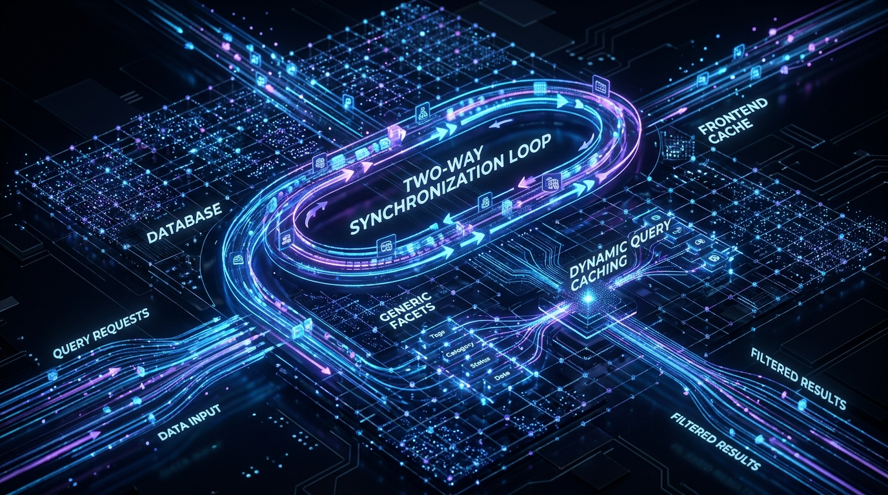

# Implementing Efficient Facet-Based Search and Navigation for a Directory of Public Companies


When building a large-scale directory of public companies, search isn't just a text box—it's a high-performance fine-grained filtering engine. Users expect to cross-reference multiple categories, locations, industries, and service types instantaneously. 

However, running complex, multi-table `JOIN` operations across a vast directory of company profiles and nested taxonomy hierarchies for every single page load will quickly bring a traditional relational database to its knees.

This article outlines a highly optimized reference architecture for facet-based search and navigation. By decoupling the read-path from the write-path using dynamic query caching and asynchronous background indexers, we can achieve sub-millisecond search query times while driving rich, dynamic filter UI.

---

## The Problem: The N+1 Filtering Nightmare

Imagine a user searching for:
**"Technology Companies in Toronto that DO NOT provide Hardware Manufacturing."**

In a normalized relational database, finding matching companies requires:
1. Joining the `Company` table to the `Location` closure table (to ensure Toronto or any of its sub-neighborhoods are included).
2. Joining the `Company` table to the `Category` table (Technology).
3. Using an `EXISTS` or `LEFT JOIN` exclusion to filter out any company tagged with "Hardware Manufacturing".

When thousands of users apply different arbitrary combinations of these filters, the database CPU spikes, and query plans thrash. 

## The Solution: The Two-Way Synchronization Loop

Instead of calculating these answers on the fly, we can treat *the search queries themselves* as first-class entities. We introduce a junction architecture powered by three core concepts:
1. **Generic Facets**
2. **Dynamic Facet Sets**
3. **Background Indexing Workers**

### 1. Generic Facets (The Building Blocks)
Every company in the database is stripped down into generic key-value pair "Facets" when they are saved. Instead of a rigid `CompanyLocation` or `CompanyCategory` table, everything becomes a `Facet`:
- `{ CompanyId: 1, FacetId: 105 }` (Category: Technology)
- `{ CompanyId: 1, FacetId: 402 }` (Location: Toronto)
- `{ CompanyId: 1, FacetId: 811 }` (Service: Software)

### 2. Dynamic Facet Sets & The Caching Layer
When a user executes a search, the frontend sends an array of requested inclusions and exclusions to the API.

The API intercepts this query using an in-memory `ExpirationCache` (e.g., an LRU/LFU hybrid cache). It hashes the specific combination of filters and checks both memory and the database: *Have we ever seen this exact combination of filters before?*

If not, the cache creates a new record called a **Facet Set**:
```json
{
  "SetId": 9942,
  "Key": "hash_of_filters",
  "InclFacets": 2,
  "Details": [
    { "FacetId": 105, "Exclude": false },
    { "FacetId": 402, "Exclude": false },
    { "FacetId": 811, "Exclude": true }
  ]
}
```

The caching layer then immediately fires a fire-and-forget background task (or pushes a message to a distributed worker queue via gRPC) to calculate the actual members of this set.

### 3. The Background Indexer (Set → Companies)
A dedicated .NET `BackgroundService` picks up the newly created `FacetSet`. Off the main request thread, it runs the heavy, complex EF Core query to find every single company that perfectly satisfies those specific rules.

It then bulk-inserts the results into a highly optimized, flat junction table called `FacetSetCompanies`:
`[SetId, CompanyId]`

The next time *any* user searches for that exact combination of filters, the database simply queries:
`SELECT CompanyId FROM FacetSetCompanies WHERE SetId = 9942`
This transforms a multi-second, 5-table JOIN query into a sub-millisecond index seek.

---

## Keeping Data Fresh: The Reverse Loop

Caching search queries is incredibly fast, but what happens when a company updates its profile? If a company moves to Toronto, it needs to instantly appear in `SetId: 9942`.

This is where the architecture completes its two-way synchronization loop.

### The Background Indexer (Company → Sets)
When a company saves its profile, a background worker is triggered to recalculate the company's generic `Facets`. 

Instead of searching for companies, the worker now searches for **Facet Sets**. It executes an EF Core query to find all existing `Facet Sets` that this company *now perfectly satisfies*.

**Conceptual SQL / Pseudo-code:**
```sql
-- Find all sets where the company possesses ALL required inclusive facets
-- AND possesses NONE of the exclusive facets.

INSERT INTO FacetSetCompanies (SetId, CompanyId)
SELECT cfs.Id, @CompanyId
FROM CompanyFacetSets cfs
WHERE 
  -- Condition 1: Company has exactly the number of required facets for this set
  cfs.InclFacets = (
    SELECT COUNT(*) 
    FROM FacetSetDetails detail
    JOIN CompanyFacets cf ON cf.FacetId = detail.FacetId
    WHERE detail.SetId = cfs.Id 
      AND detail.Exclude = 0 
      AND cf.CompanyId = @CompanyId
  )
  -- Condition 2: Company has NONE of the excluded facets for this set
  AND NOT EXISTS (
    SELECT 1 
    FROM FacetSetDetails detail
    JOIN CompanyFacets cf ON cf.FacetId = detail.FacetId
    WHERE detail.SetId = cfs.Id 
      AND detail.Exclude = 1 
      AND cf.CompanyId = @CompanyId
  )
```
If the company perfectly satisfies a Set, it inserts itself into the junction table. If it no longer satisfies a Set it used to belong to, it deletes itself.

---

## UI Navigation & Driving the Filter Sidebar

This flat junction architecture isn't just for speeding up search results—it powers the "available vs. applied filters" sidebar experience.

### Available vs. Applied Facets
Once a user selects filters (like "Technology" and "Toronto"), the backend resolves the `SetId`. To populate the sidebar with remaining filter options, the backend can execute an ultra-fast aggregation over the junction table:

```csharp
// Find all remaining generic facets that exist within the current Set's companies
var availableFacets = await dbContext.FacetSetCompanies
    .Where(fsc => fsc.SetId == currentSetId)
    .Join(dbContext.CompanyFacets, 
          fsc => fsc.CompanyId, 
          cf => cf.CompanyId, 
          (fsc, cf) => cf.FacetId)
    .GroupBy(facetId => facetId)
    .Select(g => new { FacetId = g.Key, Count = g.Count() })
    .ToArrayAsync();
```
Because `FacetSetCompanies` is a pre-computed flat table, this grouping and counting operation is lightning fast. The UI can instantly render sidebar facets (e.g., "Software [150]", "Consulting [45]") without ever recalculating the complex underlying location boundaries or exclusion logic.

### Shallow Routing & State Sync
To keep the UI snappy, Modern Single Page Applications (SPAs) should synchronize this facet state directly into the browser's URL using shallow routing (e.g., `window.history.replaceState`). 

When a user toggles a facet in the sidebar:
1. The frontend pushes the updated Facet IDs into the URL (`?inclFacets=105,402&exclFacets=811`).
2. The UI fires an event to re-fetch the data.
3. The API intercepts the new combination, checks the `SetsCache`, and instantly returns the pre-computed matching companies alongside the newly aggregated available facets.

## Addressing Architecturally Significant Issues

When implementing this pattern in production, several architecturally significant issues must be carefully managed to ensure stability at scale:

### 1. Why not just use a Star Schema?
A traditional star schema (Fact and Dimension tables) is the gold standard for OLAP workloads (e.g., PowerBI, Snowflake). However, it is fundamentally designed for data analytics, not high-concurrency web traffic.
- If you used a star schema, the database would still have to execute dynamic `JOIN` operations at runtime for every user search. 
- This architecture acts as a dynamically **Materialized View**. It calculates the JOINs offline and flattens them into `FacetSetCompanies`. The web user experiences an O(1) single-table index seek with zero JOINs, preserving your database CPU for actual transactional workloads.

### 2. The Combinatorial Explosion (Cache Bloat)
If you cache every unique combination of filters users ever click, won't the `FacetSetCompanies` table eventually consume terabytes of space?
Yes, if left unchecked. To prevent storage bloat, the `FacetSets` table must implement a strict **LRU/LFU (Least Recently/Frequently Used) eviction policy**. 
- The cache tracks a `HitCount` and `LastUsed` timestamp for every Set. 
- A nightly scheduled job sweeps the database, identifying Sets that haven't been queried in 30 days or have a low hit count, and permanently deletes them (cascading the deletion to the junction table) to reclaim space.

### 3. The Cache Stampede (Thundering Herd)
What happens if a popular influencer links to a brand-new, uncached filter combination, causing 1,000 users to request it simultaneously? 
To prevent 1,000 background workers from calculating the exact same Set, the API must implement **Request Coalescing**. The first request creates the `FacetSet` and acquires a lock to spawn the worker. The subsequent 999 requests hit the cache, see the Set is in a "Calculating" state, and gracefully wait (or return a partial loading UI) rather than overwhelming the database.

### 4. Eventual Consistency
This architecture trades strict ACID consistency for extreme read performance. There is a small window (usually milliseconds to seconds) where a company updates its profile, but the background worker hasn't yet added/removed it from the relevant `FacetSets`. For a public directory, this eventual consistency is a highly acceptable trade-off compared to the alternative of slow page loads.

## Conclusion

By treating search combinations as cached, first-class entities (`FacetSets`) and utilizing asynchronous background workers to maintain a flat junction table (`FacetSetCompanies`), you can entirely bypass the database CPU bottlenecks inherent in dynamic filtering. 

This architecture trades a slight, asynchronous delay on the write-path (company profile updates) for a massively scalable, sub-millisecond read-path (user searches and facet aggregations)—exactly where it matters most for a directory of public companies.
